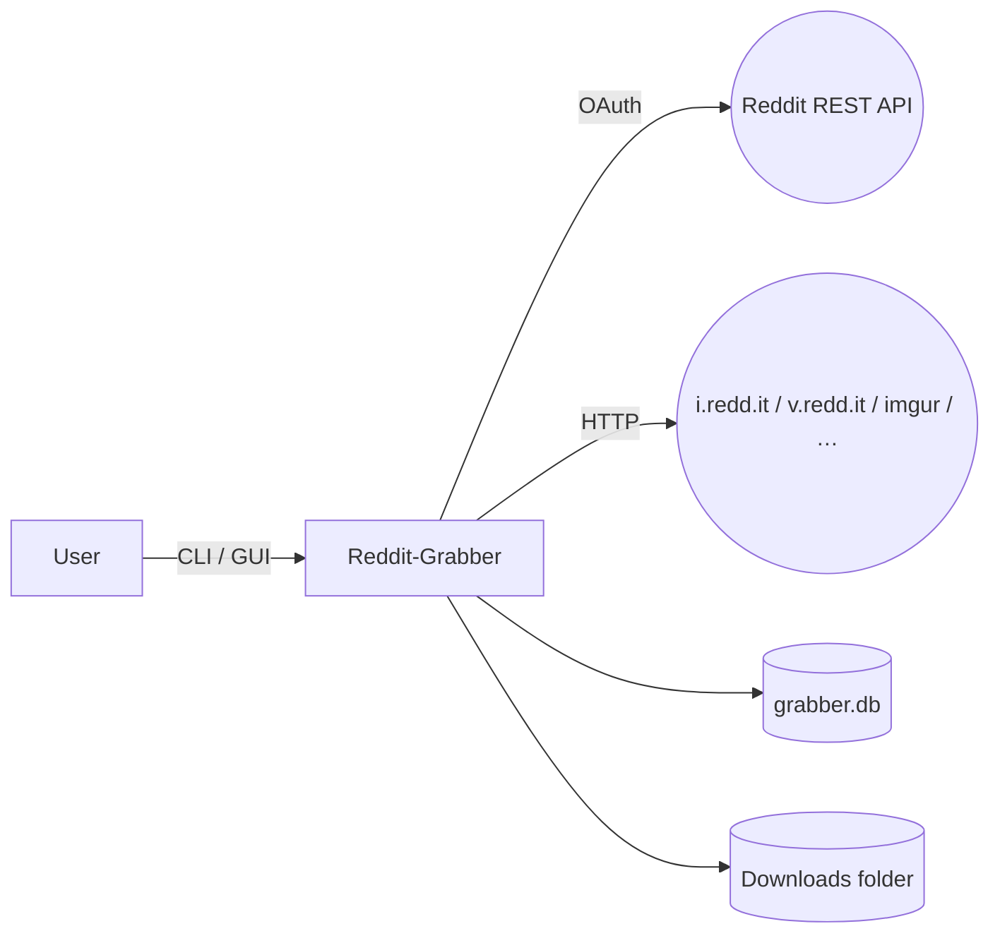

# Reddit Grabber — Functional Specification

*Version 0.9 · May 28 2025*

---

## 1 · Purpose

The **Reddit Grabber** is a cross‑platform utility that downloads every image **and** video referenced in a Reddit submission or a filtered slice of a subreddit feed.  It is designed for:

* **Archival** — keep local copies of high‑quality media before links rot or hosts disappear.
* **Curation** — enable hobbyists to bulk‑collect themed media (e.g., wallpapers, references, meme datasets).
* **Automation** — provide a composable CLI & API for scripts, cron jobs, or GUI wrappers.

---

## 2 · Scope

| ✅ Included                                                                                                        | ❌ Excluded                                   |
| ----------------------------------------------------------------------------------------------------------------- | -------------------------------------------- |
| Command‑line interface (CLI)                                                                                      | Mobile apps                                  |
| Textual TUI dashboard (Terminal UI)                                                                               | Full Electron desktop app (Phase 2)          |
| Optional PySide6 / Qt desktop wrapper (Phase 1.5)                                                                 | Writing a cloud backend                      |
| Image + video retrieval from: Reddit CDN (`i.redd.it`, `v.redd.it`), Imgur, Redgifs, Gfycat, generic direct links | Support for private / login‑gated subreddits |
| De‑duplication & manifest logging                                                                                 | Advanced ML tagging                          |
| SQLite cache for resumable sync                                                                                   | Torrent seeding                              |
| MIT open‑source release                                                                                           | Commercial license management                |

---

## 3 · Glossary

| Term             | Meaning                                                                                  |
| ---------------- | ---------------------------------------------------------------------------------------- |
| **Submission**   | A single Reddit post (image, link, text, gallery, video).                                |
| **Search slice** | A set of submissions returned by a combination of subreddit + filters.                   |
| **Grab**         | The act of downloading every resolvable media resource linked to a submission.           |
| **Sync**         | Iteratively grab all submissions in a search slice, skipping duplicates using the cache. |
| **Hash**         | SHA‑1 of a downloaded file used for de‑duplication across runs.                          |
| **Manifest**     | `manifest.json` written per‑submission containing metadata & resolved media URLs.        |

---

## 4 · System Context



*No server component is required; all calls originate from the end‑user machine.*

---

## 5 · Functional Requirements

### 5.1 CLI Commands

| Command                         | Synopsis                                                                   | Description |
| ------------------------------- | -------------------------------------------------------------------------- | ----------- |
| `grabber grab <submission‑url>` | Download all media from one post.                                          |             |
| `grabber sync <subreddit>`      | Traverse a subreddit using the **search layer** & download matching media. |             |
| `grabber db‑vacuum`             | Clean and optimise the SQLite cache.                                       |             |
| `grabber version`               | Print semantic version & build info.                                       |             |

#### 5.1.1 Global Flags

* `‑‑output <dir>` — custom destination root (default `./downloads`).
* `‑‑config <path>` — load extra defaults from a TOML/YAML config file.
* `‑‑quiet / ‑q` — suppress normal log lines (errors only).
* `‑‑ui {none,textual,pyside}` — force chosen UI wrapper.

### 5.2 Search Filters (`sync` only)

| Flag                          | Description                                                 | Example              |
| ----------------------------- | ----------------------------------------------------------- | -------------------- |
| `‑‑query <str>`               | Keyword search in *title* (AND‑joined).                     | `"corgi beach"`      |
| `‑‑flair <regex>`             | Include only posts whose flair matches regex.               | `"(?i)OC"`           |
| `‑‑since / ‑‑until`           | ISO date or duration (`3d`, `6h`).                          | `--since 2025‑05‑01` |
| `‑‑min‑score <n>`             | Skip submissions below Reddit score.                        | `--min-score 100`    |
| `‑‑media {images,videos,all}` | Pre‑filter by `post_hint` & URL.                            |                      |
| `‑‑user <name>`               | Only posts by specific author(s).                           | multiple allowed     |
| `‑‑limit <n>`                 | Max submissions fetched this run.                           | default 100          |
| `‑‑allow‑nsfw`                | Explicitly permit NSFW content.                             | opt‑in               |
| `‑‑pushshift`                 | Fall back to Pushshift API when Reddit search is throttled. | optional             |

### 5.3 Download Behaviour

* Video downloading delegated to **yt‑dlp** — handles DASH (v.redd.it), HLS, and external embeds.
* Images fetched via `requests` with 15 s timeout, 3 retries (exponential back‑off).
* Output path pattern (configurable):
  `«OUTPUT_ROOT»/{subreddit}/{id}/{safe_title}/`.
* SHA‑1 computed after write.  If hash already exists in cache, file is discarded.

### 5.4 Manifest JSON Schema (`v1`)

```jsonc
{
  "id": "abc123",
  "subreddit": "aww",
  "title": "Very smol corgi…",
  "author": "u/doge",
  "permalink": "/r/aww/comments/abc123/…",
  "utc_timestamp": 1753123123,
  "score": 5321,
  "flair": "OC",
  "downloaded": [
    "corgi.jpg",
    "corgi_zoomies.mp4"
  ]
}
```

### 5.5 SQLite Cache

```sql
CREATE TABLE files (
  hash       TEXT PRIMARY KEY,
  path       TEXT,
  first_seen INTEGER
);
CREATE TABLE posts (
  id         TEXT PRIMARY KEY,
  permalink  TEXT,
  downloaded INTEGER DEFAULT 0,
  last_check INTEGER
);
```

*Resumable sync* queries `posts.downloaded` to avoid re‑processing.

### 5.6 Configuration Sources (priority order)

1. **CLI flags**
2. `GRABBER_…` environment variables
3. `~/.config/reddit‑grabber/config.toml`
4. Project‑local `grabber.toml`

### 5.7 Authentication

* Uses **application‑only OAuth** (Reddit “script” app).
* Secrets are loaded from `.env` or env‑vars & never logged.

### 5.8 NSFW & Privacy

* NSFW posts are **skipped** unless `--allow-nsfw` is set.
* Filenames are sanitized; no user PII beyond Reddit username is stored.

---

## 6 · User‑Interface Specifications

### 6.1 Textual TUI (default when terminal ≤ 120 cols)

```
┌ Reddit‑Grabber ─────────────────────────┐
│ [Subreddit]  r/aww   [Query] corgi      │
│ [🔍  Fetch]  Limit: 100  NSFW: Off      │
│─────────────────────────────────────────│
│ # | ↑Score |  Title                     │
│ 1 | 5.3k   | Very smol legged…         │
│ 2 | 2.1k   | [OC] beach zoomies (vid)  │
│···                                      │
│──────────────────────────────────────── │
│ ⬇ Download queue                        │
│ ✔ corgi_zoomies.mp4  ✓ 14 MB            │
└─────────────────────────────────────────┘
```

* Arrow keys / mouse select rows → **Space** adds to queue.
* `D` toggles auto‑download.
* Live Rich progress bars per file.

### 6.2 PySide6 Desktop (optional)

* Menu bar: *File > New Sync*, *Tools > Vacuum Cache*.
* Central QTableView bound to `QAbstractTableModel` of search results.
* Drag‑and‑drop output folder chooser.

### 6.3 Web Mini‑Server (future)

* Flask + HTMX, served at `localhost:8000`.
* No auth; CORS = `same‑origin`.

---

## 7 · Non‑Functional Requirements

| Category          | Requirement                                                                                |
| ----------------- | ------------------------------------------------------------------------------------------ |
| **Performance**   | 20 concurrent downloads max, adaptive to host throttling.                                  |
| **Portability**   | Runs on Python ≥ 3.9, Windows/macOS/Linux.                                                 |
| **Reliability**   | Safe resume after abrupt termination; database journaling on by default.                   |
| **Security**      | No secrets written to manifest or logs; follows Reddit API TOS.                            |
| **Accessibility** | TUI supports screen‑reader friendly Rich markup; Qt UI adheres to WCAG AA colour contrast. |
| **License**       | MIT (OSI‑approved).                                                                        |

---

## 8 · Architecture

* **grabber.cli** — Typer CLI facade
* **grabber.search** — constructs `SearchParams`, yields `praw.models.Submission`
* **grabber.downloader** — idempotent file fetcher + yt‑dlp wrapper
* **grabber.database** — thin SQLite DAL (SqliteDict or bare `sqlite3`)
* **grabber.ui** — pluggable front‑ends reusing service layer

All heavy I/O (download, DB writes) pushes to a `ThreadPoolExecutor` to keep UIs responsive.

---

## 9 · Error Handling & Logging

| Level | Sink                    | Example                                  |
| ----- | ----------------------- | ---------------------------------------- |
| DEBUG | hidden unless `‑‑debug` | Full Reddit JSON payload                 |
| INFO  | stdout (Rich)           | “✓ Saved 2 files to …/aww/abc123/”       |
| WARN  | stderr                  | “Retrying (2/3) 503 Service Unavailable” |
| ERROR | stderr & `grabber.log`  | Tracebacks with timestamp                |

---

## 10 · Dependencies

* **praw ≥ 7.7** (or *asyncpraw* later)
* **yt‑dlp ≥ 2025.04**
* **requests ≥ 2.32**
* **typer ≥ 0.12** + **rich ≥ 13**
* **textual ≥ 0.50** (TUI)
* **python‑dotenv ≥ 1.0**
* **pytest ≥ 8** + **pytest‑mock** (dev)

---

## 11 · Testing & CI

1. **Unit** — mock Reddit API, assert search filters & file‑save logic.
2. **Integration** — nightly GitHub Actions job against `r/redditdev` (public test sub).  Ensures no API regressions.
3. **Smoke** — run `grabber grab <known post>` inside docker image, checksum expected files.

---

## 12 · Delivery & Milestones

| Milestone                  | Target | Contents                                                      |
| -------------------------- | ------ | ------------------------------------------------------------- |
| **M1** — Core CLI MVP      | Day 5  | `grab` command, manifest JSON, env config.                    |
| **M2** — Search & Sync     | Day 12 | `search` layer, `sync` with limit/date filters, SQLite cache. |
| **M3** — Textual TUI       | Day 18 | Live dashboard, queue management.                             |
| **M4** — Packaging         | Day 22 | `pipx` install, Homebrew formula draft, Dockerfile.           |
| **M5** — Desktop GUI Alpha | Day 30 | PySide6 wrapper, installer skeleton.                          |

---

## 13 · Future Enhancements

* Automatic EXIF stripping / metadata preservation toggle.
* Parallel S3 / GDrive uploader plugin.
* Duplicate‑finder across previously archived subreddits.
* Hooks for Stable Diffusion tagging pipeline.
* WebSocket API for remote control.

---

*End of specification*
